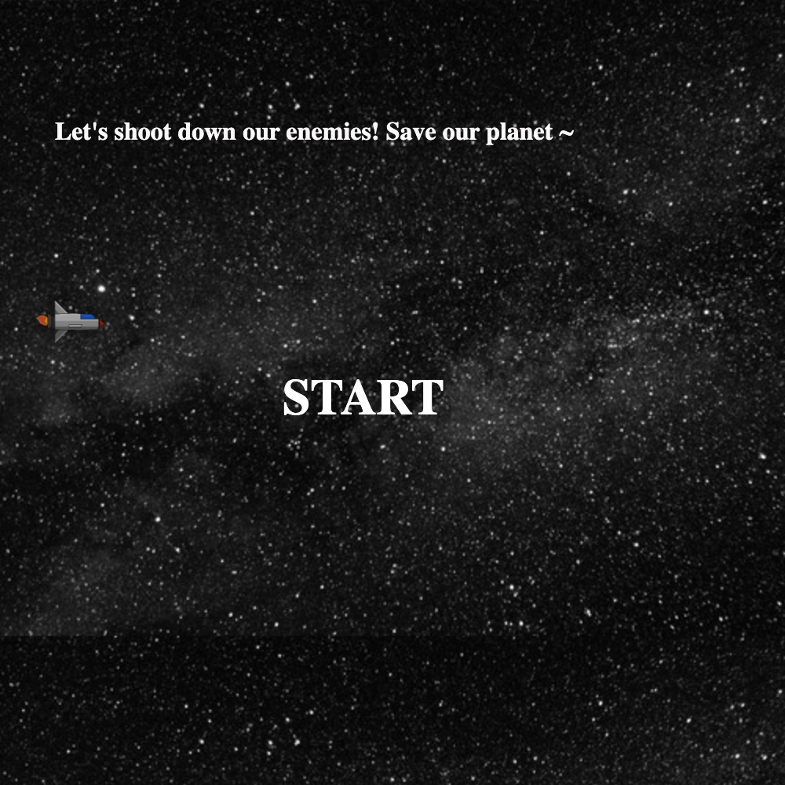
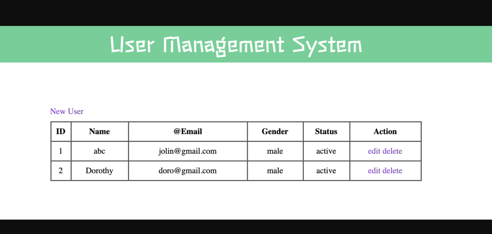

## Portfolio

---

### Past Project
---

[Space Shooting Game](https://heavensender.github.io/spaceShootingGame/p1.html)
---
#Childhood Fav Game (HTML+Javascript)

---
[User Management App](https://ga-p2usermanagementweb.herokuapp.com/)
---
#A place to manage forum user information (MERN)

---
[Book Gram          ](https://mernbookgram.herokuapp.com/)
---
#To share your fav books (Group work with [Benson](https://github.com/bzknightz) & [Terry](https://github.com/Terrykoek) )

---
[Class Booking System          ](http://heavensender.pythonanywhere.com/)
---
#Let members book their Yoga classes online. 

---
<!-- ### Category Name 2

- [Project 1 Title](http://example.com/)
- [Project 2 Title](http://example.com/)
- [Project 3 Title](http://example.com/)
- [Project 4 Title](http://example.com/)
- [Project 5 Title](http://example.com/)
 -->
---
 
 

---

---

Page template forked from <a href="https://github.com/evanca/quick-portfolio">evanca</a>

<!-- Remove above link if you don't want to attibute -->
